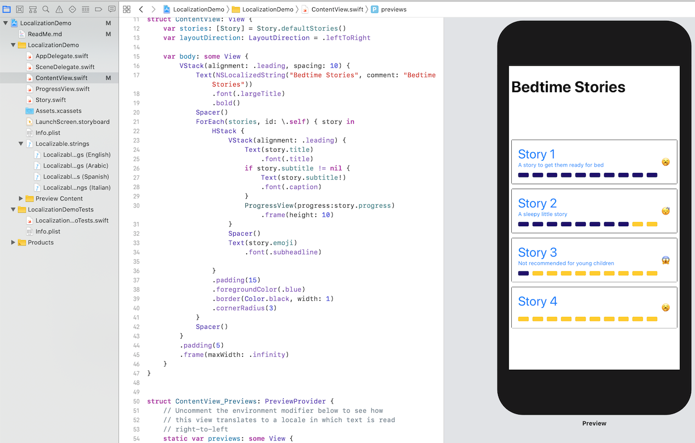
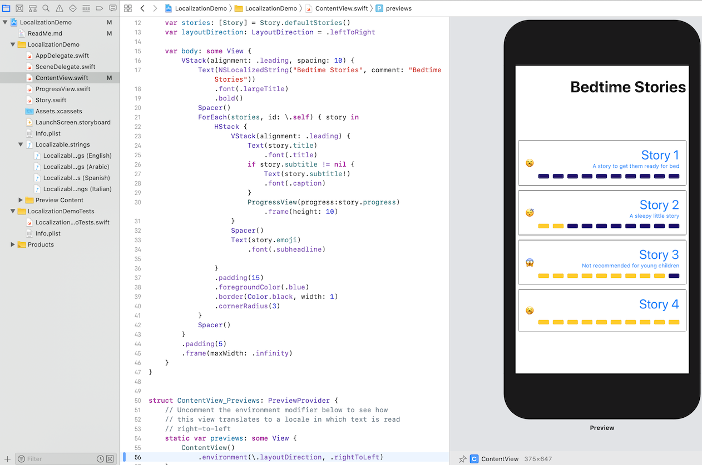
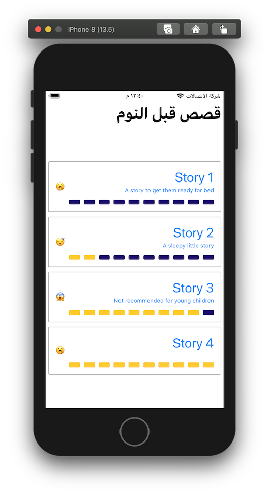
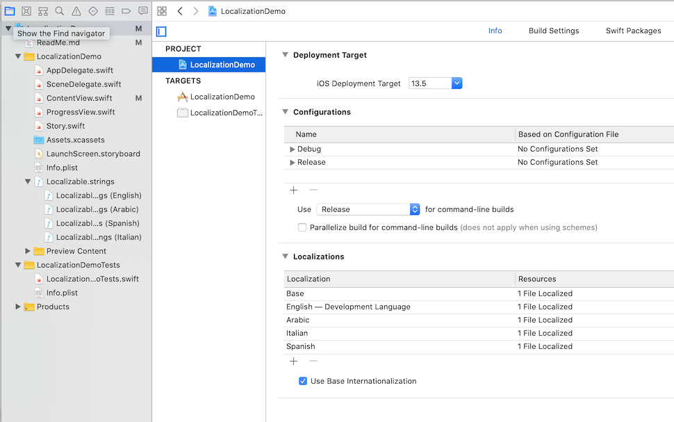

# LocalizationDemo

This is a short but sweet Bedtime Stories app that shows off some localization tricks for SwiftUI.

## Layout direction

When we use things like alignment modifiers on our VStacks we'll get some automatic behavior when we switch our app context from viewing it in a left-to-right layout (like English) to viewing it in a right-to-left layout context (like Arabic).

Left to right:

Adding the environment modifer `.layoutDirection` to lay out our app in right to left mode:

In addition to layout direction, this app also shows you a minimal bit of localization, which you can test out on-device or in the simulator. The app has been localized to Italian and Spanish (badly) and Arabic (possibly even worse!).

[Translation errors are my own, apologies!]

## Add more localizations
To add more localizations you would tap on the blue project item in the project navigator. Select the project option (not a target), and you can add localizations to the project there. We have our starter set of English, Spanish, Italian, and Arabic.

